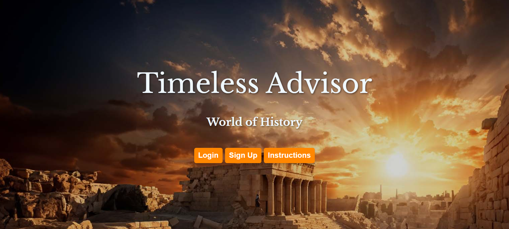

# Timeless Advisor

## Project Overview

Timeless Advisor is an immersive educational game that allows players to step into the role of an advisor to a renowned historical figure. The mission is to guide the character through critical life events, offering advice on pivotal moments. The game features interactive questions where correct answers lead to progress, while incorrect answers provide opportunities to retry. The experience concludes with either a win or loss state, accompanied by a summary of performance.

**Table of Content**

- Features
- Technologies
- Project Structure
- Installation Guide
- Usage
- Testing
- Contributing

## Features

### Login and Registration:

Secure user authentication with options to register and log in.

### Character Selection:

Choose from various historical figures to guide through their pivotal moments.

### Interactive Gameplay:

Answer questions to progress through events in the character’s life.

### Feedback Mechanism:

Receive immediate feedback on answers with options to retry if incorrect.

### Game State Modals:

Pop-up modals to indicate game results, including win and loss states.

### Performance Tracking:

View and submit high scores based on gameplay performance.

**Technologies Used**

- HTML5
- CSS3
- JavaScript
- Bootstrap for responsive design
- Fetch API for server communication
- Jest for unit and integration testing

## Deployment:

API Deployment: Deployed using Render for hosting the backend API.

## Project Structure

---

| **Directory/File**         | **Description**                                |
| -------------------------- | ---------------------------------------------- |
| `client/`                  | Root directory for the client-side application |
| ├── `test/`                | Directory for testing-related files            |
| │ ├── `DOM/`               | Tests for DOM-related functionality            |
| │ │ ├── `index.test.js`    | Index page tests                               |
| │ │ ├── `login.test.js`    | Login page tests                               |
| │ │ ├── `signup.test.js`   | Signup page tests                              |
| │ ├── `integration/      ` | Integration tests                              |
| │ ├── `unit/`              | Unit tests                                     |
| │ ├── `utils/`             | Utility function tests                         |
| │ └── `setupTests.js`      | Test setup and configuration                   |
| ├── `assets/`              | Static assets                                  |
| │ ├── `css/`               | Stylesheets                                    |
| │ ├── `dist/`              | Distribution files including bundles           |
| │ ├── `images/`            | Image assets                                   |
| │ ├── `js/`                | JavaScript files                               |
| │ └── `utils/`             | Utility scripts                                |
| ├── `coverage/`            | Code coverage reports                          |
| ├── `characters.html`      | Character selection page                       |
| ├── `game.html`            | Main gameplay interface                        |
| ├── `index.html`           | Homepage                                       |
| ├── `login.html`           | Login page                                     |
| ├── `signup.html`          | Registration page                              |
| └── `submission.html`      | Score submission page                          |
| `README.md`                | Project overview and instructions              |
| `.gitignore`               | Git ignore file                                |

---

**Installation Guide**

To set up and run the Timeless Advisor frontend locally, follow these detailed steps:

- Clone the Repository

First, clone the repository to your local machine using Git:

git clone <repository-url>
cd <project-directory>

- Install Node.js

Ensure you have Node.js installed on your machine. Node.js is required for managing dependencies and running any build tools if applicable. You can download and install Node.js from the official website.

- Install Dependencies

Although the frontend primarily uses static files, ensure you have any development dependencies installed:

Run `npm install`

This will install any necessary packages specified in the package.json file, if applicable.

- Run a Local Server

To view the project locally, you can use a simple HTTP server. If you have Python installed, you can use the built-in HTTP server:

python -m http.server 8000

Alternatively, you can use Node.js packages like http-server:

npm install -g http-server
http-server

This will start a local server, usually accessible at http://localhost:8000.

- Open the Project

Open your web browser and navigate to http://localhost:8000 (or the port number used by your local server) to view and interact with the Timeless Advisor game.

## Usage

Authentication:

### Sign Up:

Register a new account on the signup.html page.

### Login:

Access your account on the login.html page.

### Character Selection:

Choose a character from the list on the characters.html page.

### Gameplay:

Navigate through questions and make decisions on the game.html page.
Progress through the game by answering questions correctly.

### Outcome Modals:

Win or loss conditions trigger modals to display the outcome.

### Score Submission:

View your score and compare it on the submission.html page.

## Testing

Ensure that all frontend features are functioning as expected:
Test Authentication: Verify that login and registration processes work correctly.
Test Character Selection: Confirm that selecting a character takes you to the game page.
Test Gameplay: Ensure that questions are displayed, answers are processed, and game state updates correctly.
Test Modals: Check that win and loss modals appear as intended.
Test Score Submission: Verify that scores are submitted and displayed accurately.

## Contributing and Future improvements

Contributions are welcome! If you have improvements or bug fixes, please fork the repository and submit a pull request with a clear description of your changes.

### Thank you for exploring this project!

Whether you're here to immerse yourself into some fun games or to explore the world of history or coding , we hope you have a great time. Enjoy the experience, and remember, every challenge is an opportunity to learn and grow. We wish you the best of luck and fun—may you come out as the ultimate winner!

